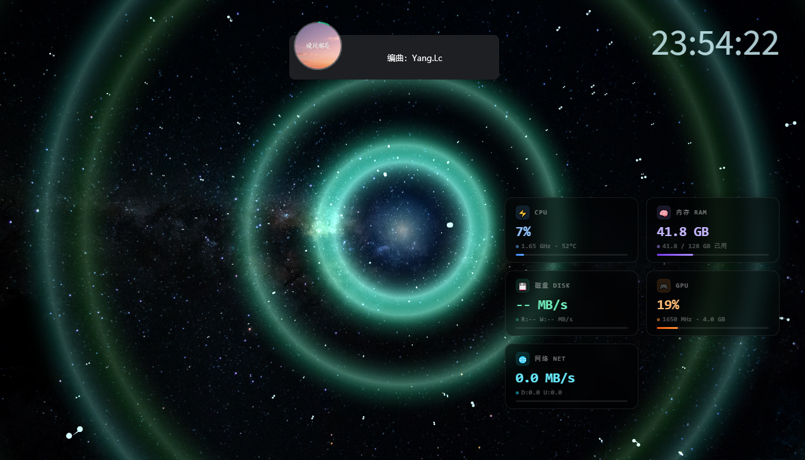
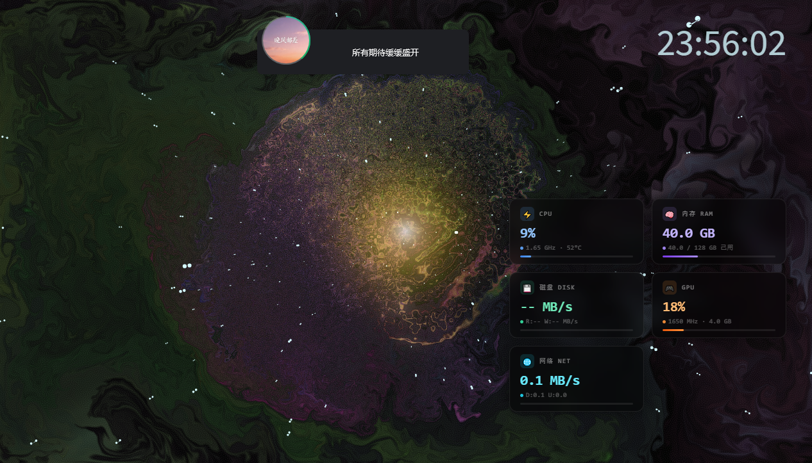
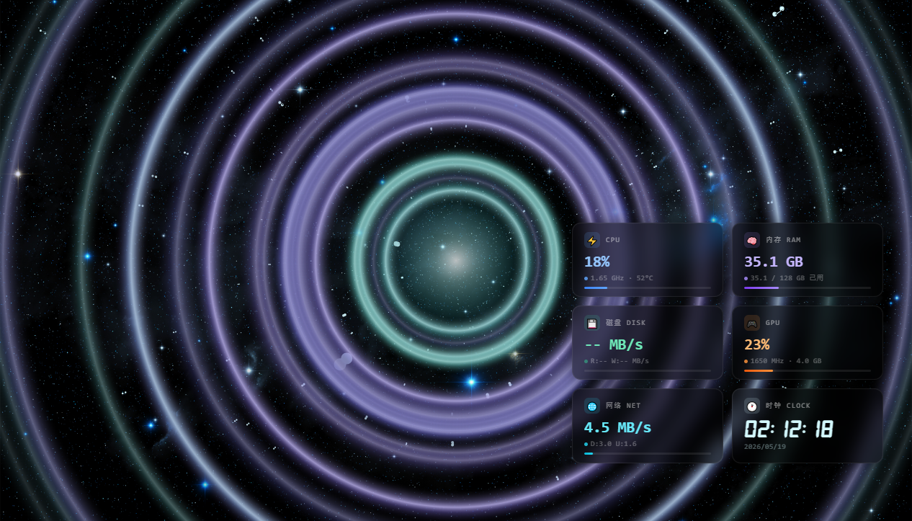
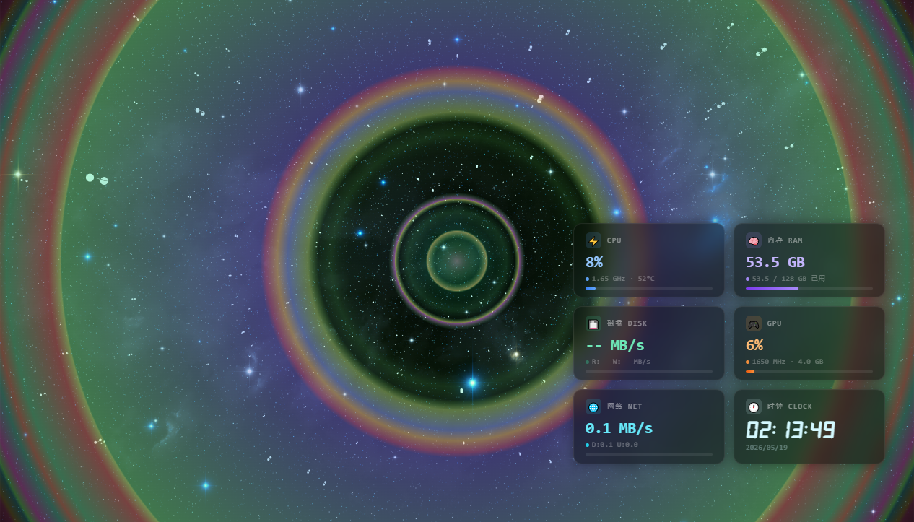

# AudioNebula — 音频律动星空

[](LICENSE)
[](https://github.com/rocksdanister/lively)

一款以**音频律动**为核心的 [Lively Wallpaper](https://github.com/rocksdanister/lively) 动态壁纸。实时音频频谱分析驱动三种独立视觉效果，辅以 3D 星空粒子、系统监控 HUD（含时钟）和中英文切换。

An audio-reactive animated wallpaper for Lively Wallpaper. Real-time 7-band audio analysis drives three distinct visual engines, with a 3D starfield, draggable HUD dashboard (with clock), and i18n support.

## 效果预览 / Preview

[▶ 观看演示视频 / bilibili](https://www.bilibili.com/video/BV1yALM6TESe)

<video src="https://github.com/user-attachments/assets/51fa4469-a4a0-4241-84cf-65333ac4bb91" controls="controls" width="100%" height="auto" autoplay="autoplay" muted="muted" loop="loop"></video>

<table>
    <tr><td width="50%"></td><td width="50%"></td></tr>
    <tr><td width="50%"></td><td width="50%"></td></tr>
</table>

## 核心特性 / Core Features

### 🎛️ 三种效果引擎

| 风格 | 子模式 | 渲染方式 | 说明 |
|------|--------|----------|------|
| **电音光圈** | 水波扩散 / 能量脉冲 / 光晕呼吸 / 电音律动 | Canvas 2D 离散环 | 经典频谱律动，低频触发涟漪，四种模式各有独立的速度/寿命/环宽公式 |
| **振膜音圈** | 同上 4 种 | Canvas 2D 合并渐变 | 多频段独立触发 → 统一径向渐变膜面渲染，模拟扬声器振膜波动 |
| **魔幻流体** | — | WebGL 流体模拟 | Navier-Stokes 流体动力学，音频驱动中心溅射，泛光+射线后处理 |

**色彩风格**：梦幻（全色谱高饱和）/ 极客（cyan-blue 冷色调低饱和），三种引擎统一适配。

### ✨ 星空粒子

- 伪 3D 透视投影（z 轴深度缩放），星星从屏幕中心向四周飞散
- 数量、大小、速度、颜色均可调，支持独立开关

### 📊 系统仪表盘 HUD

- CPU / RAM / Disk / GPU / Network / 时钟 六张卡片
- 实时数据 + 进度条 + 颜色预警（绿色 → 黄色 → 红色）
- 支持拖拽定位，位置持久化（localStorage）
- 每张卡片可独立显隐

### 🎵 音频分析

- **7 频段**实时频谱分析（Sub-bass / Bass / Low-mid / Mid / High-mid / Presence / Brilliance）
- 电音光圈集成**人声识别**：中频段（130-4000Hz）独立触发紫色涟漪
- 无音频时自动回退到模拟鼓点（kick + snare + hi-hat，BPM~120）

### 🌐 中英文切换

内置 i18n 语言包，HUD 标题动态切换。

## 安装 / Installation

1. 安装 [Lively Wallpaper](https://github.com/rocksdanister/lively) (Windows 10/11)
2. 下载最新 [Release](https://github.com/fsg-herbie/lively-wallpaper-audioNebula/releases) `.zip` 文件
3. 拖入 Lively Wallpaper 窗口或 `添加壁纸` → `选择文件`
4. 右键壁纸 → `自定义` 调整参数

> 也可手动复制整个文件夹到 `%LOCALAPPDATA%\Lively Wallpaper\Library\wallpapers\`

## 配置项 / Configuration

### 语言 / Language

| 参数 | 类型 | 默认值 | 说明 |
|------|------|--------|------|
| `LANG` | 下拉 | 中文 | 中文 / English |

### 星空粒子 / Starfield

| 参数 | 类型 | 默认值 | 说明 |
|------|------|--------|------|
| `PARTICLE_CHECK` | 复选框 | ✅ | 显示星空 |
| `PARTICLE_NUM` | 滑块 10-2000 | 500 | 星星数量 |
| `PARTICLE_BASE_RADIUS` | 滑块 0.01-5.0 | 1.4 | 星星大小 |
| `DEFAULT_SPEED` | 滑块 0.01-50 | 2 | 飞行速度 |
| `PARTICLE_COLOR` | 颜色选择器 | #D4F9FF | 星星颜色 |

### 背景 / Background

| 参数 | 类型 | 默认值 | 说明 |
|------|------|--------|------|
| `BACKGROUND_CHECK` | 复选框 | ✅ | 显示背景图 |
| `CANVAS_IMAGE` | 下拉 | default.jpg | 背景图选择（`images/` 目录） |

### 氛围灯 / KTV Lighting

| 参数 | 类型 | 默认值 | 说明 |
|------|------|--------|------|
| `KTV_CHECK` | 复选框 | ✅ | 启用氛围灯 |
| `KTV_STYLE` | 下拉 | 电音光圈 | 三种渲染引擎 |
| `KTV_EFFECT_MODE` | 下拉 | 电音律动 | 子模式（魔幻流体忽略） |
| `KTV_COLOR_STYLE` | 下拉 | 梦幻 | 色彩风格 |
| `KTV_INTENSITY` | 滑块 0.1-3.0 | 1.0 | 音频灵敏度 |
| `KTV_RIPPLE_SPEED` | 滑块 0.2-3.0 | 1.0 | 涟漪扩散速度 |
| `KTV_RIPPLE_SPREAD` | 滑块 0.2-3.0 | 1.0 | 涟漪扩散范围 |
| `KTV_CORE_SIZE` | 滑块 0.2-3.0 | 1.0 | 中心光球大小 |

### 流体魔幻 / Fluid Magic（仅在 KTV_STYLE=魔幻流体时生效）

| 参数 | 类型 | 默认值 | 说明 |
|------|------|--------|------|
| `FLUID_SPLAT_RADIUS` | 滑块 1-100 | 25 | 溅射大小 |
| `FLUID_CURL` | 滑块 0-50 | 30 | 湍流强度 |
| `FLUID_DENSITY_DISSIPATION` | 滑块 0-40 | 10 | 染料消散速度 |
| `FLUID_BLOOM_INTENSITY` | 滑块 10-200 | 80 | 泛光强度 |
| `FLUID_SHADING` | 复选框 | ✅ | 边缘着色 |
| `FLUID_COLORFUL` | 复选框 | ✅ | 色彩循环 |

### 时钟 & HUD / Clock & HUD

| 参数 | 类型 | 默认值 | 说明 |
|------|------|--------|------|
| `FONT_CHECK` | 复选框 | ✅ | 显示时钟 |
| `HUD_CHECK` | 复选框 | ✅ | 显示系统监控 |
| `NETWORK_CHECK` | 复选框 | ✅ | 显示网络卡片 |

## 项目结构 / Structure

```
├── index.html              # 主页面 + Lively API 事件 (audio/system/property)
├── css/
│   └── index.css           # HUD 样式 + DIGIT-CL 字体声明
├── js/
│   ├── i18n.js             # 中英文语言包
│   ├── fluid.js            # WebGL 流体引擎 (Pavel Dobryakov, MIT)
│   ├── LDR_LLL1_0.png     # 抖动纹理
│   └── index.js            # 星空粒子 / 三种 KTV 引擎 / HUD 数据
├── images/                 # 背景图资源
├── digit-cl.ttf            # 时钟专用字体
├── LivelyInfo.json         # 壁纸元数据 (Type 1, 启动参数)
├── LivelyProperties.json   # 用户可配置属性
├── LICENSE                 # MIT
└── README.md
```

## 技术要点 / Technical Notes

### 三种渲染引擎

- **电音光圈** — 32 频段频谱 → bass delta 触发 + 人声中频独立触发，原始 b99d8317 离散环算法（`source-over` 合成）
- **振膜音圈** — 7 频段分析 → 4 通道独立 delta 检测 + 持续微弱发射，所有涟漪汇入单一径向渐变（色标合并去重），模拟连续膜面
- **魔幻流体** — WebGL Navier-Stokes 模拟，bass delta 触发 `fluidSplatAtCenter`，Bloom + God Rays 后处理

### 音频处理管道

```
Windows 系统音频 → WasapiLoopbackCapture (NAudio)
  → 2048 点 FFT (C# 端) → 1024 频率 bin (Float32Array)
  → window.livelyAudioListener(audioArray)
      ├── 32-band: pow + Math.min 截断 → audioState (供电音光圈+流体)
      └── 7-band: pow + softNorm 软压缩 → audioAnalysis (供振膜音圈)
```

### 其他

- **无音频回退** — 3 秒未收到真实音频自动启动 synthAudio（kick+snare+hi-hat 模拟）
- **数据平滑** — `lerp()` 插值（HUD 0.08-0.15，音频 0.4-0.6），解耦渲染帧率
- **伪 3D 星空** — `scale = 200 / z` 透视投影，z 轴 500-2000 随机初始化

## 致谢 / Credits

- 星空颗粒基础框架基于 [ProjectSoft-STUDIONIONS/space-lively-wallpaper](https://github.com/ProjectSoft-STUDIONIONS/space-lively-wallpaper)
- WebGL 流体引擎基于 [Pavel Dobryakov / WebGL-Fluid-Simulation](https://github.com/rocksdanister/WebGL-Fluid-Simulation)（MIT License）

## 许可证 / License

MIT — 详见 [LICENSE](LICENSE)
